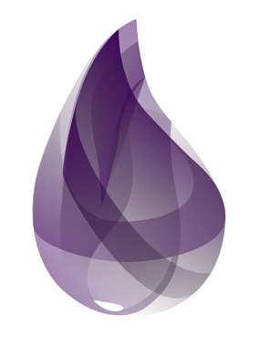

footer: Elixir Lightning Talk #mixit16 @21croissants 2016-04-21
slidenumbers: true
build-lists: true


# [fit] Elixir

_**battle tested & optimized for devs happiness**_

---


I FELT
A GREAT
DISTURBANCE
IN THE FORCE

^ I guess I am an early adopter:) I started with java in the past century! 1998

^ Then in 2005, I found out about Ruby and fell in love.
I have been a happy Ruby developer for 10 years ...

^ But again, I felt a great disturbance in the force.
Suddenly, all the alpha geeks with a beard I was following were all
tweeting about Elixir. So, I started to read books, listen some podcast,
watch some confs, to buys some books. And now, I am very excited about Elixir too: I have started to learn it.
I feel there is a great future coming for this language and Erlang VM.

---

### Jose Valim

^ This is the CREATOR of Elixir: Jose Valim. He is the one playing the guitar at Euruko 2011 in Berlin where he gave his 1st talk Elixir.
^ He is smart. Super smart.
On top of that, Jose is a really good prompt, always ready to help and teach others. The elixir
community is like him, very friendly and welcoming

---
- Functional
- Erlang
- Pretty syntax 

^ Elixir in 1 slide;) 
^ Functional: list of buzz words: Pattern matching (awesome), Macros (if
is a macro), Immutability, Pipes, much more to learn!
^ Erlang: as fast as Erlang, can call Erlang functions with no cost.
Battle tested for concurrency and distributed
^ Erlang syntax is not optimized for devs hapiness. Elixir is, it also
looks like Ruby ;)

---
```elixir
defmodule HelloWorld do
  @doc "Greets by name, or by **"Hello, World!"** `if` no name is given."

  def hello(), do: "Hello, World!"

  def hello(name) do
    "Hello, #{name}!"
  end
end
```

---


^ Erlang. More than 1B of active users. 15 backend software engineers. It's 30
years old, older than most of you! Mature! battle tested!!!

---
### Phoenix Framework
#### chat room with 2 million users on 1 machine


---
## Critical Mass?


---


##25M downloads all time 

---


---
## meetup.com/Lyon-Elixir
### Thursday, June 9


^ And I organize a meetup in Lyon. June, 9th

---
## Conferences


---

## Podcast

---
## Screencasts


---
## Books


---
# Practice


[exercism.io](http://exercism.io/) by [Katrina Owen](@kytrinyx)

^ It's free, open source and collaborative. If you remember 1 thing from
talk: remember exercism.io Learn 30 languages, including Elixir!

---
# [fit] Jobs?

:white_medium_small_square: *__TODO__*

---
## Thank you! :bow:
### _**meetup.com/Lyon-Elixir**_ Thursday, June 9
### @21croissants

