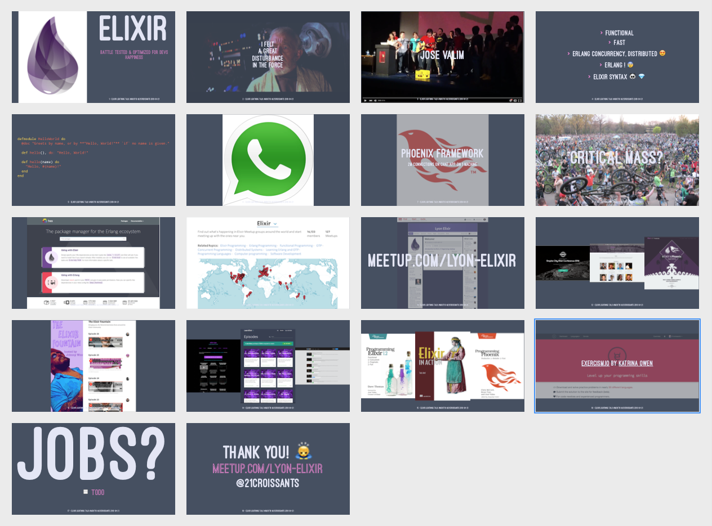

# Elixir ecosystem lightning talk
(WIP) 5 minutes Lightning Talk introducing Elixir (eco system, community) I want to give at conferences and meetups.

### Overview

### Feedback is welcome

I am writing this talk using Markdown in the CONTENT.md file. pdf is
generated using (expensive) Deckset.

Being an elixir noob, I welcome your feedback, even Pull Requests ;)

### License

Collective Commons, please re-use this presentation.
